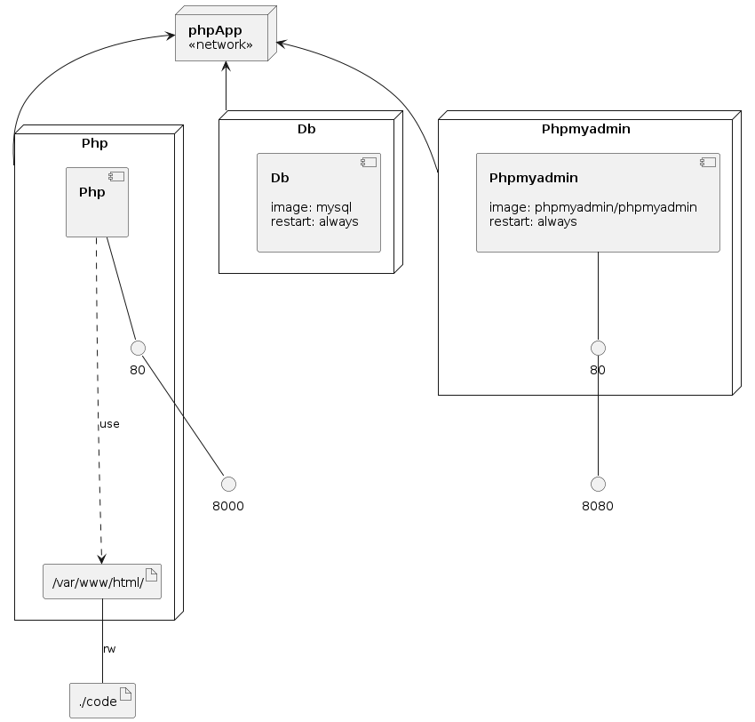

# practica-docker-compose-php

## Levantar servicios

- Analiza el contenido del fichero docker-compose.yml.
- Define las variables de entorno y comprueba que se leen mediante *docker-compose config*
- Levanta los servicios mediante *docker-compose up -d*

## Comprobar funcionamiento de la aplicación

- Carga el fichero de datos sql mediante phpmyadmin
- Comprueba el funcionamiento correcto

## Servicio php con PDO

- Modifica el servicio php para que sea posible el acceso a BBDD mediante PDO
- Comprueba el funcionamiento
- Modifica la imagen del servicio php para que no use volúmenes y súbela a Docker Hub

### Infrastructure model

